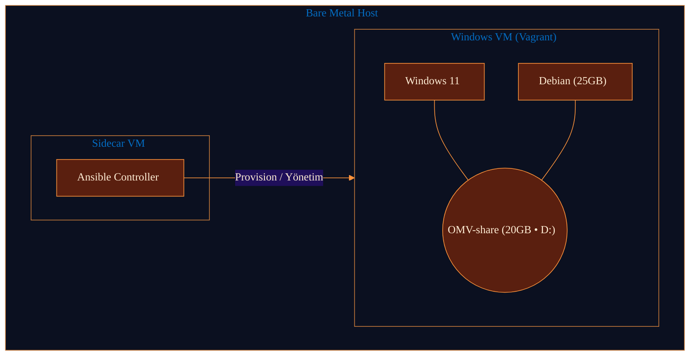

# main-goal
Bu sayfada, projenin tamamının ana hedefi yer almaktadır.

```mermaid
%%{init: {'theme':'base', 'themeVariables': {
  'primaryColor': '#5a1f0f',
  'primaryBorderColor': '#fb923c',
  'primaryTextColor': '#ffedd5',
  'lineColor': '#fb923c',
  'tertiaryColor': '#fb923c',
  'clusterBkg': '#0b1020',
  'clusterBorderColor': '#f97316',
  'fontFamily': 'Inter, ui-sans-serif, system-ui'
}}}%%

flowchart TB

  %% Bare Metal Host (2 VM içerir)
  subgraph HOST["Bare Metal Host"]
    direction LR

    %% Sidecar VM
    subgraph VM1["Sidecar VM"]
      ANS["Ansible Controller"]
    end

    %% Vagrant ile oluşturulmuş Windows VM
    subgraph VM2["Windows VM (Vagrant)"]
      direction TB
      WIN["Windows 11"]
      DEB["Debian (25GB)"]
      OMV(("OMV-share (20GB • D:)"))
    end
  end

  %% İlişkiler
  ANS -->|Provision / Yönetim| VM2
  WIN --- OMV
  DEB --- OMV

```
