```mermaid

timeline
    title Project Roadmap
    section Başlangıç
      14 Ağustos : 🎯 Proje başlangıç
    
    section Lab Ortamı Oluşturma
      21 AÄŸustos : Task1
      29 AÄŸustos : -

    section Eylül Görevleri
      5 Eylül    : -
    

    section Ekim Görevleri
      3 Ekim     : -
  

    section Kasım Görevleri
      7 Kasım    : -
   
Windows 11
```

# main-goal
Bu sayfada, projenin tamamının ana hedefi yer almaktadır.

---
## Hiyerarch

  The main goal of our project is to enable users to access their files from anywhere, with complete freedom and flexibility. Files will be stored distributed throughout your own repositories, allowing you to have full access to them wherever you are. The topology seen above is the lab environment created for the first phase. This lab environment involves a topology where the OMV disk, located on a multi-boot computer, is automatically mounted regardless of the operating system it's running on, and automatically mounted to the operating system's home folder using a suitable file sharing protocol. This allows you to easily access your OMV-shared folder from anywhere, regardless of your location. The entire structure in the task is managed by sidecar ansible. You can view the task's process diagram below:

---
## Task 1 Summary
---

---

